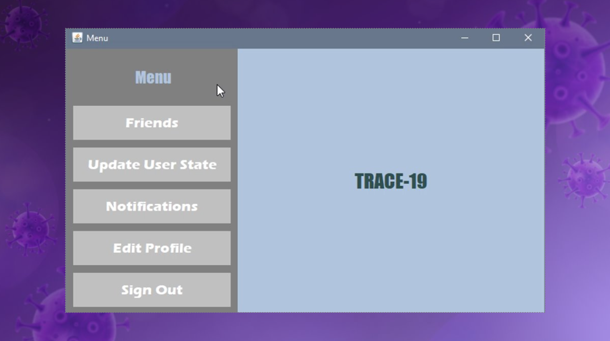

# Trace19

## About

Trace19 is an application that aims to be a form of
social network which prevents the spread of covid-19. 

In particular, every can register in the application and create a profile. When the user creates the profile he enters some basic nformation (name, phone, age, gender etc.) and his current health status regarding the virus (negative, positive, recovered from the virus). Also the user can create a list of friends. He can add friends by searching their phone number (the friends have to be registered in the app). Then the user can inform his contacts about his health status in case he is tested and found positive for the virus or if he recovered from covid-19. This update is done through notifications that are send to the first two circles of contacts: the people he has on his friends list, the corresponding contacts of his friends. The people who are in the second circle of contacts are only updated when the user tests positive and not when he recovers. Also, they are not informed about the name of the sick user for privacy reasons. But a notification is sent, which informs them that a person who is in the contact list of a friend of theirs is sick.

In addition the application also provides the typical features of a network. Specifically,
after registering (class Signup ) or entering the account (class Login), the user can edit the information he has entered. He can modify the name, password, municipality, health status regarding covid-19 and also delete the account. In case
modification of the health status attribute, as already mentioned, notifications are automatically sent to the two circles of contacts followed by some information such as the date and name. It is noted that notifications are sent to the following
cases :
- If the user tested positive
- If the user was infected with the virus and has now recovered

## Run

### Database requirements
- Download a mysql database and create a new connection with Hostname 127.0.0.1 and Port 3306
- Create a new schema
- In the new schema open the `data.sql` file and execute it
- Create a new user for the server with the following attributes:

   Login Name= exception

   Authentication Type= Standard

   Limit to Hosts Matching= localhost

   Password= 123

### Application jar

Dowload the project locally and run the `Trace-19.jar` file.